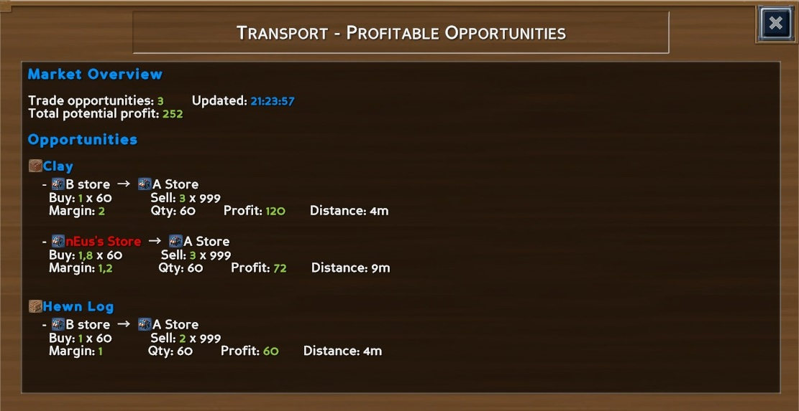

# ECO Transport Mod

A useful and lightweight mod to help players find transport opportunities.

You can make money out of buying / selling goods, but sometimes it is hard to track these opportunities.
This mod helps you track prices and filter buy / sell orders where you can make profit.

## Easy install

Also available from [mod.io]()

Copy `EcoTransportMod` __folder__ on your server into your mods folder `\Server\Mods\UserCode`

Reboot your server and it's done !

## Usage

See available commands by typing `/transport info`

### Available commands 

| Commands | Description |
| -------- | ----------- |
| **UI Panel Commands** |  |
| /transport panel | Open the main UI panel |
| /transport find < product > | Search with UI panel |
| /transport detail < product > | Details product analysis |
| |
| **Chat Commands** |  |
| /transport stats | Show market margin opportunities |
| /transport search < product > | Search for a specific product |
| /transport refresh | Refresh market data |
| /transport export | Export data to JSON (admin only) |
| /transport info | Show this help |
| |

## Contributions

Contributions and bug reports are welcome !
