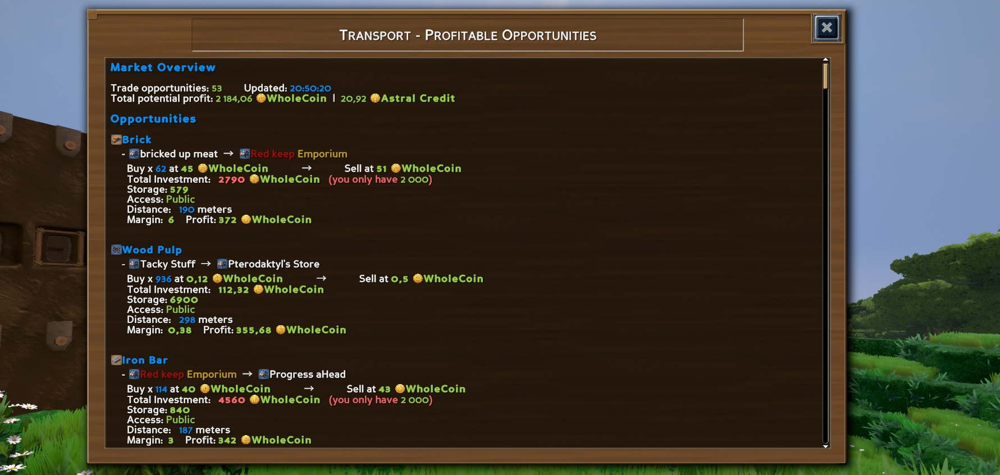

# ECO Transport Mod
Mod for the game Eco, edited by StangeLoop studio.
[https://play.eco/](https://play.eco/)

A useful and lightweight mod to help players find transport opportunities.

You can make money out of buying / selling goods, but sometimes it is hard to track these opportunities.
This mod helps you track prices and filter buy / sell orders where you can make profit.

## Easy install

Also available from [mod.io](https://mod.io/g/eco/m/eco-transport#description)

Copy `EcoTransportMod` __folder__ on your server into your mods folder `\Server\Mods\UserCode`

Reboot your server and it's done !

## Features

- Find profitable trade opportunities across all stores
- Filter by matching currency (buy and sell must use same currency)
- Native Eco UI with clickable links for stores, items and currencies
- Distance calculation between buy/sell locations
- Check you can afford the investment
- Check buyer's can afford the delivery, and have available storage.

## Usage

See available commands by typing `/transport info`

### Available commands

| Command | Description |
| ------- | ----------- |
| `/transport panel [n]` | Open the main UI panel (max 200 items) |
| `/transport find <product>` | Search with UI panel |
| `/transport detail <product>` | Detailed product analysis |
| `/transport refresh` | Refresh market data |
| `/transport info` | Show help |

## Contributions

Contributions and bug reports are welcome !

### Future Plan
- Add storage space check at buyer's store
- Improve UI experience (resize window, components -> buttons, select, tables)
- Add filtering on player's skill production & player's own materials
- Add config command : learned skill, transport method(cart, truck) 
- Add transportation info (number of trips required)
- [New Skill] Add a configurable variable for admins to make it a skill, which locks all features except public ones behind it.
- [Skill Feature] Add automatique itinerary suggestion.
- [Public Feature] Add feature DeliveryOpportunity which allow any user to place an order with delivery, and transporter (only) to answer it. Would probably take benefit of contracts.